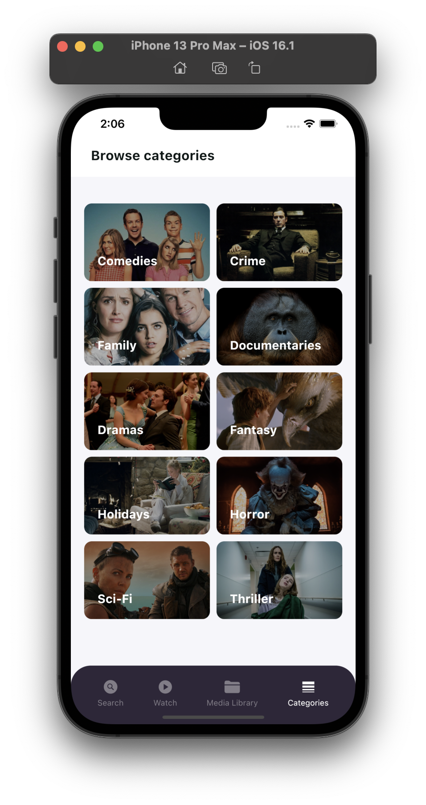

# imdb_movies_app

IMDB mobile application developed with the initial design provided in FIGMA, Main features including: Searching movies, trending movies, top movies, categories exploration, Movie detail, seat reservation with time and date selection with Provider and MVC Architecture

[Android APK](https://drive.google.com/file/d/15lvQSy1iqdK4J6tIsPROPn6T9UX5MIwA/view?usp=sharing)

[FIGMA Design](https://www.figma.com/file/zUxb8in82YlB1aaXarSVO9/IMDB-Clone-app-design?node-id=0%3A1&t=VSt5FPMO9PP9u3YI-1)

[Demonstration video of code and application](https://drive.google.com/file/d/1x6MK8NxIz0-MNdFVdEOsvY_lEIAMA6RL/view?usp=sharing)

[Working app video - Simulator](https://drive.google.com/file/d/1XcdzaLeLJs0cgYUrOp-s0Ts09bJqL3Ee/view?usp=sharing)

    

 

    

 

    

 

    

 

    

 

    

