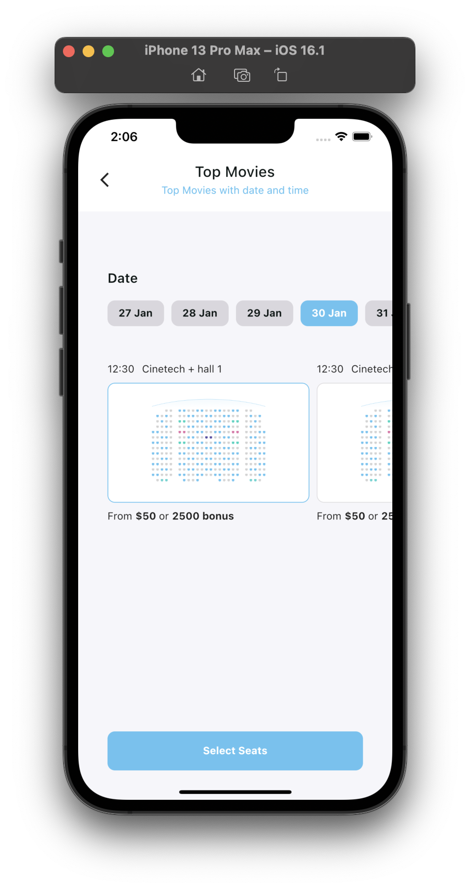

# imdb_movies_app

IMDB mobile application developed with the initial design provided in FIGMA, Main features including: Searching movies, trending movies, top movies, categories exploration, Movie detail, seat reservation with time and date selection with Provider and MVC Architecture

[Android APK]()

[Video Demonstration of app working]()

    

 

    

 

    

 

    

 

    

 

    

